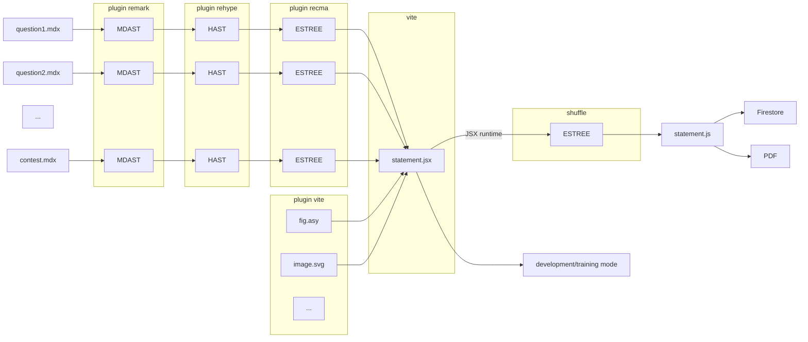

# Architecture

QuizMS is a framework that allows the generation of static websites that can be hosted on services like Github Pages, Firebase Hosting, etc. QuizMS does not have a server and does not support server-side rendering; all logic occurs either client-side or during compilation.

This makes database and authentication management a bit more complicated. Currently, these parts are handled through Firestore and Firebase Authentication, which can be used directly client-side without the need for a server. Although QuizMS was designed to be independent of the backend used, currently the only supported backend is Firebase, and the internal logic is optimized to work with Firestore's data model.

## Used Libraries

QuizMS is mainly based on [Vite](https://vitejs.dev/): a bundler that allows deep customization of the build process.

The other main libraries used are:

  - [React](https://react.dev/): UI.
  - [Tailwind CSS](https://tailwindcss.com/): CSS.
  - [MDX](https://mdxjs.com/) with [remark/rehype/recma](https://unifiedjs.com/learn/guide/introduction-to-unified/) plugins: Markdown problem parsing.
  - [Blockly](https://developers.google.com/blockly): Block code.
  - [Lodash](https://lodash.com/): Generic utilities.
  - [Lucide](https://lucide.dev/): Icons.
  - [Wouter](https://github.com/molefrog/wouter): Routing.
  - [Zod](https://zod.dev/): Data validation.

## Statements

Statements are written in Markdown or MDX and are transformed into JavaScript via `@mdx-js/mdx`. The transformation occurs in multiple phases:

  - the file is parsed into [MDAST](https://github.com/syntax-tree/mdast) (Markdown Abstract Syntax Tree);
  - [remark](https://github.com/remarkjs/remark) plugins are applied;
  - the MDAST is transformed into [HAST](https://github.com/syntax-tree/hast) (HTML Abstract Syntax Tree);
  - [rehype](https://github.com/rehypejs/rehype) plugins are applied;
  - the HAST is transformed into [ESTREE](https://github.com/estree/estree) (ECMAScript Abstract Syntax Tree);
  - [recma](https://mdxjs.com/docs/extending-mdx/#list-of-plugins) plugins are applied;
  - the ESTREE is transformed into JavaScript;
  - the JavaScript code of each problem is combined into a single JavaScript file.

During development, the code undergoes no further transformations and is executed in the browser.

During contests, however, the code undergoes additional steps:

  - the code **is executed** using QuizMS's JSX runtime, which again produces an ESTREE of the code itself;
  - sensitive parts of the code are removed (e.g., solutions);
  - the order of questions and answers is changed based on the chosen variant;
  - the ESTREE is transformed into JavaScript and minimized;
  - the code is saved to the database.

The code is executed to remove all superfluous JavaScript code and produces completely static code without variables, loops, and selections. Although this part is essential for removing all sensitive information from the code, it does not allow for interactive code, for example with Blockly.

