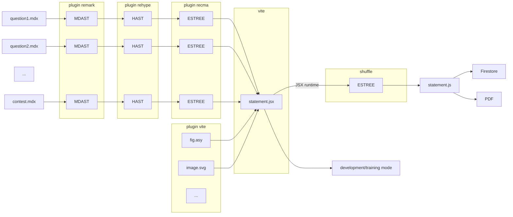

# Architettura

QuizMS è un framework che permette la generazione di siti web statici che possono essere hostati su servizi come Github Pages, Firebase Hosting, ecc. QuizMS non ha un server e non supporta il server-side rendering, tutta la logica avviene o lato client, o durante la compilazione.

Ciò rende un po' più complicata la gestione del database e dell'autenticazione. Al momento queste parti vengono gestite attraverso Firestore e Firebase Authentication, che possono essere utilizzate direttamente lato client senza bisogno di un server. Sebbene QuizMS sia stato progettato per essere indipendente dal backend utilizzato, al momento l'unico backend supportato è Firebase e la logica interna è ottimizzata per funzionare con il modello di dati di Firestore.

## Librerie utilizzate

QuizMS è basato principalmente su [Vite](https://vitejs.dev/): un bundler che permette di personalizzare a fondo il processo di build.

Le altre principali librarie usate sono:
- [React](https://react.dev/): UI.
- [Tailwind CSS](https://tailwindcss.com/): CSS.
- [MDX](https://mdxjs.com/) con i plugin [remark/rehype/recma](https://unifiedjs.com/learn/guide/introduction-to-unified/): parsing dei problemi in Markdown.
- [Blockly](https://developers.google.com/blockly): codice a blocchi.
- [Lodash](https://lodash.com/): utility generiche.
- [Lucide](https://lucide.dev/): icone.
- [Wouter](https://github.com/molefrog/wouter): routing.
- [Zod](https://zod.dev/): validazione dei dati.

## Testi

I testi sono scritti in Markdown o MDX e vengono trasformati in JavaScript attraverso `@mdx-js/mdx`, la trasformazione avviene in più fasi:
- il file parsato in [MDAST](https://github.com/syntax-tree/mdast) (Markdown Abstract Syntax Tree);
- vengono applicati i plugin [remark](https://github.com/remarkjs/remark);
- il MDAST viene trasformato in [HAST](https://github.com/syntax-tree/hast) (HTML Abstract Syntax Tree);
- vengono applicati i plugin [rehype](https://github.com/rehypejs/rehype);
- il HAST viene trasformato in [ESTREE](https://github.com/estree/estree) (ECMAScript Abstract Syntax Tree);
- vengono applicati i plugin [recma](https://mdxjs.com/docs/extending-mdx/#list-of-plugins);
- l'ESTREE viene trasformato in JavaScript;
- il codice JavaScript di ogni problema viene unito in un unico file JavaScript.

Durante lo sviluppo, il codice non subisce ulteriori trasformazioni e viene eseguito nel browser. 

Durante le gare, invece, il codice effettua dei passaggi in più:
- il codice **viene eseguito** utilizzando il runtime JSX di QuizMS che produce nuovamente un ESTREE del codice stesso;
- vengono rimosse le parti sensibili del codice (es. le soluzioni);
- l'ordine delle domande e delle risposte viene cambiato in base alla variante scelta;
- l'ESTREE viene trasformato in JavaScript e viene minimizzato;
- il codice viene salvato nel database.

Il codice viene eseguito in modo da rimuovere tutto il codice JavaScript superfluo e produce del codice completamente statico senza variabili, cicli e selezioni. Sebbene questa parte sia essenziale per rimuovere tutte le informazioni sensibili dal codice, non permette di avere del codice interattivo, ad esempio con Blockly.

