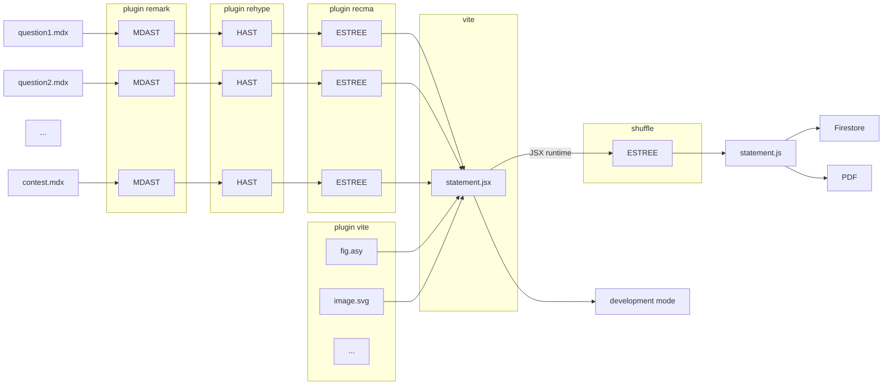

# Generazione dei problemi

```mermaid
flowchart LR
    subgraph plugin remark
        md1[MDAST]
        md2[MDAST]
        mdc[MDAST]
    end
    subgraph plugin rehype
        h1[HAST]
        h2[HAST]
        hc[HAST]
    end
    subgraph plugin recma
        es1[ESTREE]
        es2[ESTREE]
        esc[ESTREE]
    end
    subgraph vite
        bundle[statement.jsx]
    end

    q1[question1.mdx] --> md1
    q2[question2.mdx] --> md2
    q3[...]
    c[contest.mdx] --> mdc

    md1 --> h1
    md2 --> h2
    mdc --> hc

    h1 --> es1
    h2 --> es2
    hc --> esc

    es1 --> bundle
    es2 --> bundle
    esc --> bundle

    subgraph plugin vite
        f1[fig.asy] --> bundle
        f2[image.svg] --> bundle
        f3[...]
    end

    bundle --> dev[development mode]

    subgraph shuffle
        bundle -- JSX runtime --> esb[ESTREE]
    end

    esb[ESTREE] --> js[statement.js]
    js --> Firestore
    js --> PDF
```
